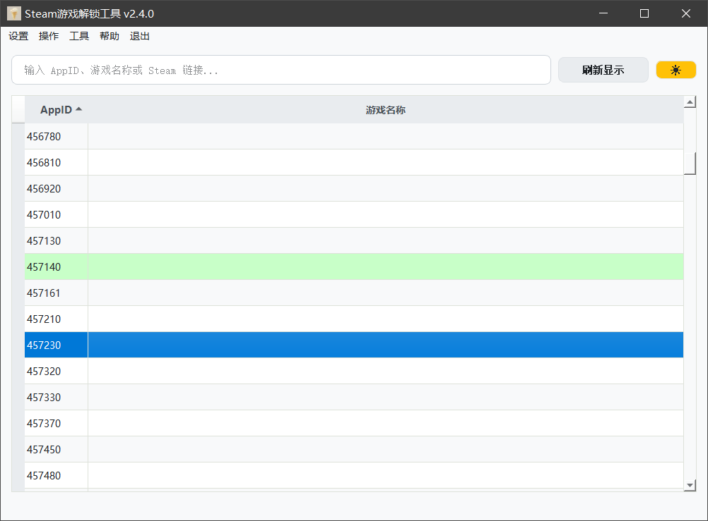
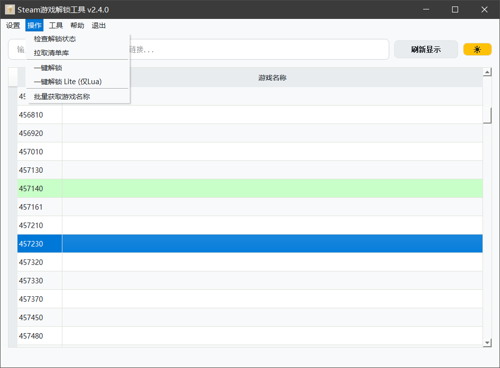
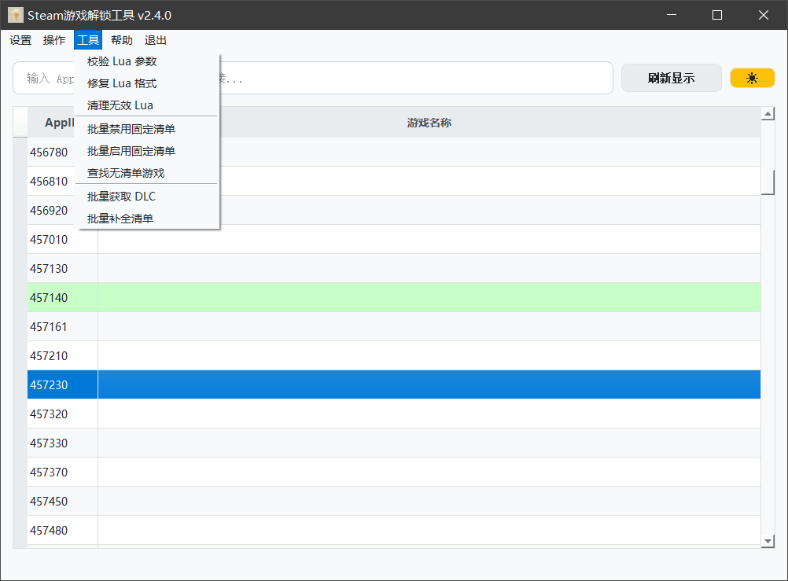
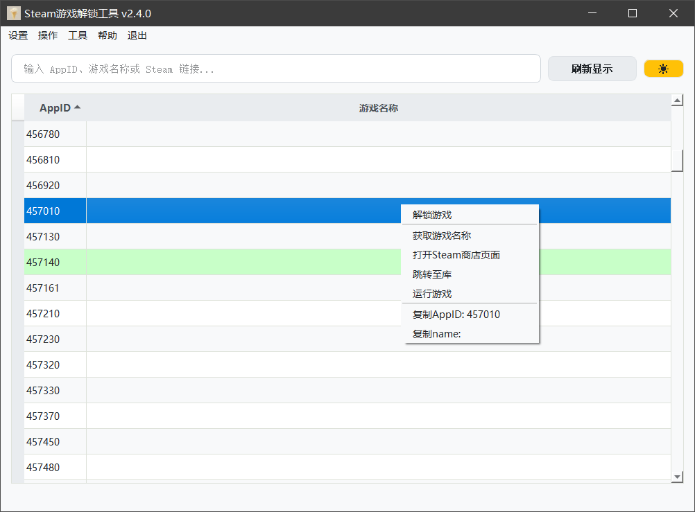
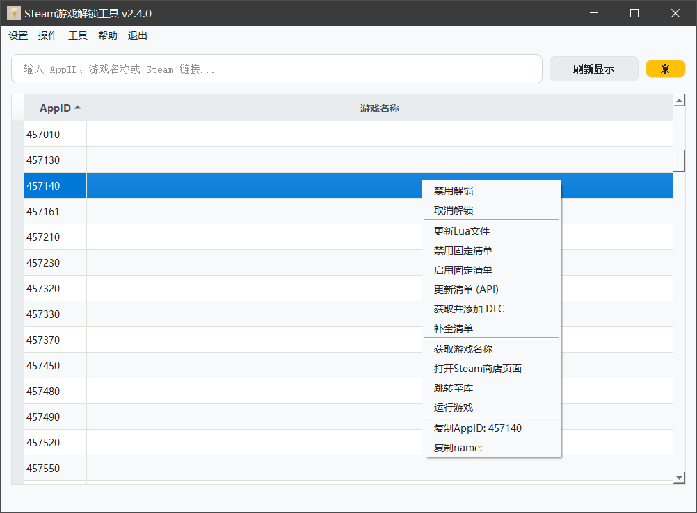
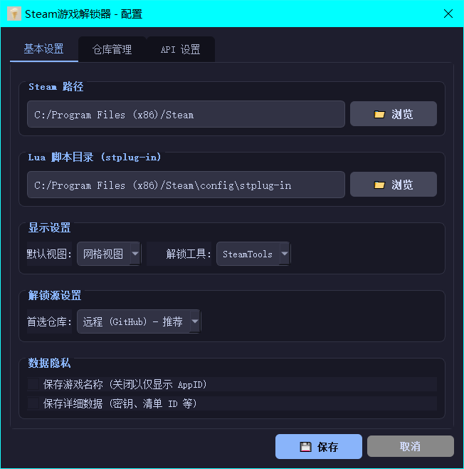
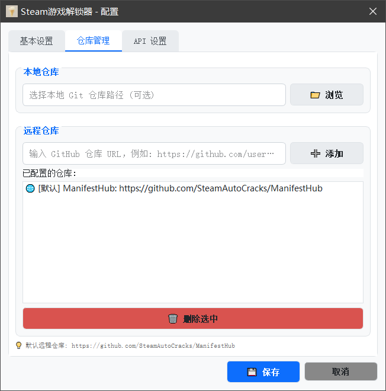
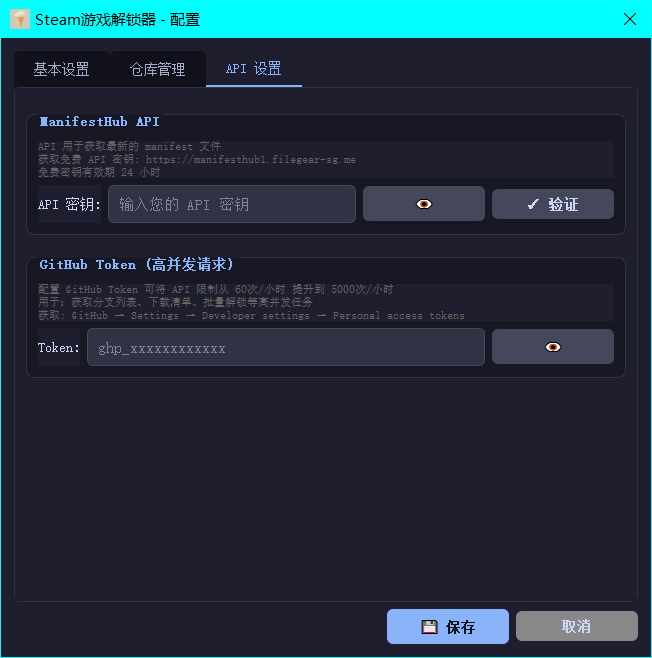

# Steam Game Unlocker / Steam 游戏解锁工具

[English](./README_EN.md) | [简体中文](./README.md)

这是一个功能强大的 Steam 游戏解锁工具，可以管理和解锁 Steam 游戏。该工具通过 Git 仓库获取游戏的清单文件和密钥，并支持使用 SteamTools 或 GreenLuma 实现解锁。

## 版本信息

- **当前版本**: v2.4.0
- **作者**: zfonlyone
- **许可证**: GPL-3.0
- **项目主页**: [GitHub](https://github.com/zfonlyone/unlock_steam)

## 功能特点

- **精美 UI**: 基于 PyQt5 的现代化图形界面，支持深色/浅色模式切换。
- **智能搜索**: 支持通过 AppID、游戏名称或直接粘贴 Steam 商店链接搜索。
- **批量处理**: 支持一键扫描并解锁所有未解锁的游戏。
- **高级工具**: 内置多种 Lua 修复和清单 management 工具。
- **安全保障**: 防篡改算法确报程序完整性。
- **高度自动化**: 自动配置路径，自动同步仓库。

## 界面功能说明

### 顶部操作栏
- **🌙/☀️**: 切换深色/浅色主题模式。
- **刷新显示**: 刷新列表显示，不重新检查文件夹。
- **检查解锁状态**: 扫描本地文件，确认哪些游戏已生效。
- **拉取清单库**: 执行 `git pull` 更新本地清单仓库。
- **一键解锁**: 自动识别所有未解锁的游戏并执行批量解锁流程。

### 高级工具栏
- **🏷️ 获取名称**: 从 Steam API 在线补充缺失的游戏名称。
- **🔍 校验lua**: 检查 Lua 脚本参数中是否包含非法字符。
- **🔒 禁用固定清单**: 给 `setManifestid` 代码添加注释，使其无效。
- **🔓 启用固定清单**: 移除 `setManifestid` 前的注释，重新启用固定清单。
- **👻 寻找无清单**: 扫描库中没有关联清单文件的 Lua 脚本。
- **🧹 清理无效Lua**: 删除那些除了基础 AppID 定义外没有实际内容的空 Lua。
- **🪄 修复格式**: 自动优化 Lua 脚本格式，移除 `None` 等无效参数。

### 右键菜单
- **解锁游戏**: 针对选定游戏执行解锁流程。
- **取消解锁**: 彻底移除已配置的解锁信息和清单。
- **禁用/启用解锁**: 快速在启用和禁用状态间切换。
- **更多管理**: 支持单独针对该游戏更新清单（API）或管理固定清单权限。
- **快速链接**: 打开 Steam 商店、库页面或直接运行游戏。
- **复制信息**: 快速复制 AppID 或游戏名称到剪贴板。

## 解锁流程详解

程序的解锁逻辑分为两个阶段：

### 1. 准备阶段 (Preparing)
- **获取清单**: 访问关联的清单 Git 仓库。
- **匹配数据**: 根据 AppID 检索对应的分支。
- **提取密钥**: 从 `key.vdf` 中读取 Depot 密钥。

### 2. 执行阶段 (Execution)
程序会根据文件情况自动选择以下路径：

#### 路径 A：标准手动模式
1. 将 `*.manifest` 文件复制到 Steam 的 `depotcache` 文件夹。
2. 将密钥信息写入相应的配置文件（SteamTools 或 GreenLuma）。

#### 路径 B：直接 Lua 模式 (推荐)
1. 复制仓库中的 `AppID.lua` 到插件目录。
2. 批量复制所有关联清单文件到 `depotcache`。
3. 调用 `luapacka.exe` 将 Lua 脚本编译为可在 Steam 中生效的格式。

## 下载与运行

### 从 Release 下载 (推荐)

1. 前往 [Releases](../../releases/latest) 页面
2. 下载以下两个文件到**同一目录**：
   - `SteamGameUnlocker-vX.X.X.exe` (主程序)
   - `downloader.exe` (高速下载器)
3. 双击 `SteamGameUnlocker-vX.X.X.exe` 启动

> ⚠️ **重要**：两个文件必须放在同一目录下，否则下载功能可能受限。

### 源码运行
1. 安装 Python 3.7+ 和 Git。
2. 安装依赖：`pip install -r requirements.txt`
3. 运行：`python app.py`

## 打包说明
详见 [打包说明.md](scripts/打包说明.md)。使用 `python build.py` 可生成单文件 EXE。

## 使用方法

### 本地清单库
若有自建本地清单库，可将清单库路径填入设置中的"清单库路径"，
格式为：
appid命名的分支
需要有appid命名的.lua文件，已经包含appid和密钥
若无，则需要含有key.vdf文件，
包含depotid和密钥
程序会自动读取key.vdf文件中的depotid和密钥，生成对应的.lua文件

### 网络清单库
若无自建清单库，可使用网络清单库
程序中自带[SteamAutoCracks](https://github.com/SteamAutoCracks/ManifestHub)的清单库

首先，点击"拉取清单库"，使用一键解锁功能，自动下载需要的文件，包含.lua脚本和加密的清单文件
或使用解锁lite，只下载.lua脚本，支持steamtools的最新版本的自动补全清单功能；

若不想全部解锁，可以在输入栏中输入你需要解锁的游戏的appID，或者steam商店链接，回车后显示解锁信息
鼠标右键该行，选择"解锁游戏"，即可解锁；

若使用steamtools自动补全清单的功能，需要对下载后的.lua脚本进行修改，点击禁用固定清单，注释掉--setManifestid，若后续需要固定清单则点击启用固定清单，取消注释--setManifestid；

程序还有检查lua脚本的功能，点击"校验lua"，会检查lua脚本中的appID和密钥是否正确；
修复格式的功能，点击"修复格式"，会自动优化lua脚本格式，移除无效参数；
空白appid，点击"寻找无清单"，会搜索库中没有关联清单文件的Lua脚本；
清理无效Lua，点击"清理无效Lua"，会删除那些除了基础AppID定义外没有实际内容的空Lua；

注意需要解锁dlc，需要通过程序的获取并添加dlc功能，点击"获取并添加dlc"，即可解锁dlc；支持批量操作

## 常见问题
1. 无法解锁游戏
检查本地清单库格式，检查网络清单库是否存活

2. 无法获取dlc
steam中显示以及获得dlc但却没有启用，或设置中dlc一栏dlc无本地下载大小，可能为dlc密钥设置错误，或未添加dlc的id，使用获取并添加dlc功能，修复lua脚本；若还是无法开启，建议寻找正版dlc对应密钥手动修复；

## 隐私与免责声明
- 个人配置文件已通过 `.gitignore` 排除，不会上传。
- 仅用于个人学习和研究。
- 软件基于 GPL-3.0 协议发布。

Copyright © 2023-2026 zfonlyone. All rights reserved.