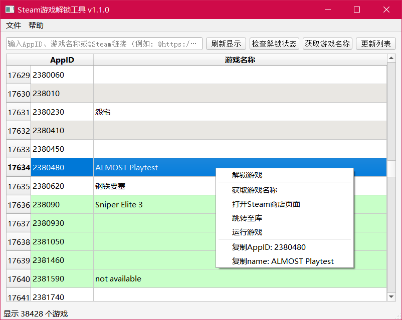

# Steam Game Unlocker

[English](./README_EN.md) | [简体中文](./README.md)

A powerful tool for managing and unlocking Steam games. It retrieves game manifest files and keys from Git repositories and supports unlocking via SteamTools or GreenLuma.

## Version Information

- **Current Version**: v2.2.0
- **Author**: zfonlyone
- **License**: GPL-3.0
- **Project Home**: [GitHub](https://github.com/zfonlyone/unlock_steam)

## Features

- **Sleek UI**: Modern graphical interface based on PyQt5, supporting Dark/Light mode.
- **Smart Search**: Search by AppID, game name, or by pasting a Steam store link.
- **Batch Processing**: Scan and unlock all locked games with a single click.
- **Advanced Tools**: Built-in Lua refactoring and manifest management utilities.
- **Security**: Anti-tamper algorithms ensure program integrity.
- **Automation**: Automatic path configuration and repository synchronization.

## UI Guide

### Top Operation Bar
- **🌙/☀️**: Toggle between Dark and Light themes.
- **Refresh Display**: Refresh the game list display without rescanning folders.
- **Check Status**: Scan local files to verify which games are currently active.
- **Pull Repo**: Run `git pull` to update the local manifest repository.
- **One-click Unlock**: Automatically identify and batch-unlock all games not yet active.

### Advanced Toolbar
- **🏷️ Get Names**: Supplement missing game names online via the Steam API.
- **🔍 Verify Lua**: Check Lua script parameters for illegal characters.
- **🔒 Disable Manifest**: Annotate `setManifestid` calls to disable fixed manifests.
- **🔓 Enable Manifest**: Remove annotations from `setManifestid` to re-enable them.
- **Ghost Search**: Scan for Lua scripts in the library that lack associated manifest files.
- **🧹 Clean Invalid Lua**: Delete empty Lua files that contain only basic AppID definitions.
- **🪄 Fix Formats**: Optimize Lua script formatting and remove invalid parameters like `None`.

### Context Menu
- **Unlock Game**: Start the unlocking process for the selected game.
- **Remove Unlock**: Completely remove configured unlock info and manifests.
- **Enable/Disable**: Quickly toggle the unlock status.
- **More Management**: Update manifests (API) or manage fixed manifest permissions for a specific game.
- **Quick Links**: Open Steam Store, Library, or run the game directly.
- **Copy Info**: Copy the AppID or Game Name to the clipboard.

## Unlocking Process

The unlocking logic consists of two main stages:

### 1. Preparing
- **Fetch Manifest**: Access the linked Git repository.
- **Match Data**: Retrieve the corresponding branch based on the AppID.
- **Extract Keys**: Read Depot keys from `key.vdf`.

### 2. Execution
The program automatically selects the best path based on available files:

#### Path A: Standard Manual Mode
1. Copy `*.manifest` files to the Steam `depotcache` folder.
2. Write key information into the configuration files (SteamTools or GreenLuma).

#### Path B: Direct Lua Mode (Recommended)
1. Copy the `AppID.lua` from the repository to the plugin directory.
2. Copy all associated manifest files to `depotcache`.
3. Invoke `luapacka.exe` to compile the Lua script into a format compatible with Steam.

## Installation & Usage

### Security Note
This program includes integrity verification. **Do not modify** core files. It is recommended to download only from the official repository.

### Running from Source
1. Install Python 3.7+ and Git.
2. Install dependencies: `pip install -r requirements.txt`
3. Run: `python app.py`

## Build Instructions
See [Build Instructions (CN)](scripts/打包说明.md). Use `python build.py` to generate a single-file EXE.

## Privacy & Disclaimer
- Personal configuration files are excluded via `.gitignore`.
- For educational and research purposes only.
- Released under the GPL-3.0 license.

Copyright © 2023-2026 zfonlyone. All rights reserved.
